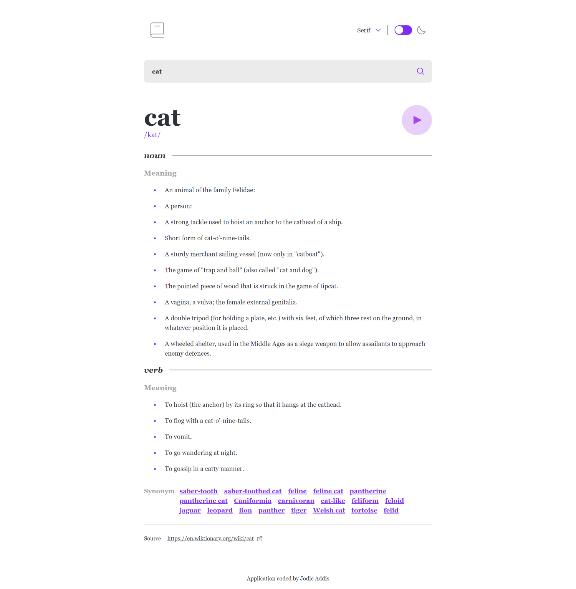

# Online Dictionary

## About the project

Dictionary application providing definitions accompanied by examples, as well as synonyms for the chosen words.

This application features 2 contexts:

- a dark mode
- a font choice for the page

All stories are hosted on Chromatic at this URL

## Objectives

- Search for words using the input field
- See the Free Dictionary API's response for the searched word
- See a form validation message when trying to submit a blank form
- Play the audio file for a word when it's available
- Switch between serif, sans serif, and monospace fonts
- Switch between light and dark themes
- View the optimal layout for the interface depending on their device's screen size
- See hover and focus states for all interactive elements on the page

## Technologies Used

